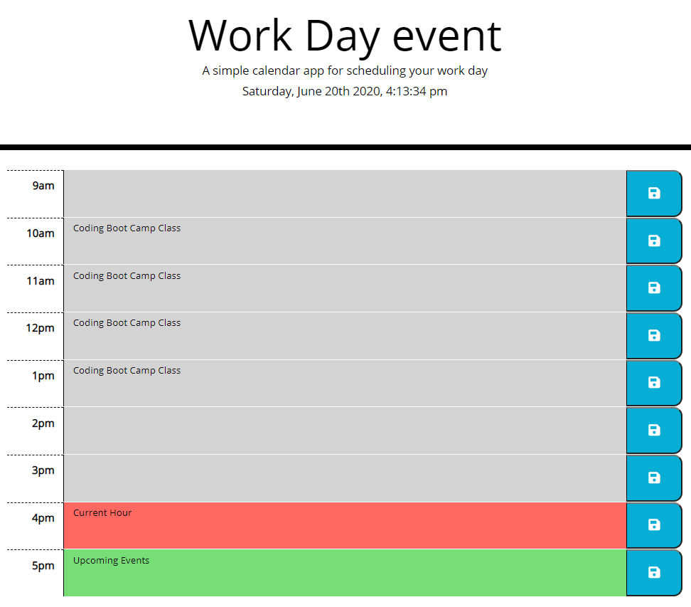

# Work Day Scheduler
A simple work day schedule planner application that allows the users to save events for each working hours from 9am-5pm

## Application Launch
Please use the link [here](https://zanhong.github.io/5-work-day-scheduler/)

## Description
- This application allows users to save entered events by pressing the "Save" button with a floppy disc icon
- The current date, day and time are displayed on top of the scheduler
- All events are saved in the local storage of the browser so that the events will stay even if the webpage is refreshed
- Depending on the time of the day, each timeblock is color-coded indicating whether it is in the past, present or future:
  - Grey - Past
  - Red - Current
  - Green - Future

## Screenshot of the Application

